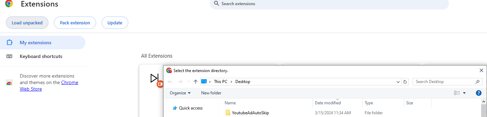

# YouTube Ad Auto Skip

Non-intrusive lightweight plugin for desktop to automate the skipping for YouTube video ads.

# Adding to Chrome

1. Clone this project into your local machine.
2. Navigate to [chrome://extensions/](chrome://extensions/) and click "Load Unpacked" and select the cloned folder.

  

## Feedback

Please feel free to reach out to me if you have any questions or feedback [**@AnthonyJHizon**](https://github.com/AnthonyJHizon)
